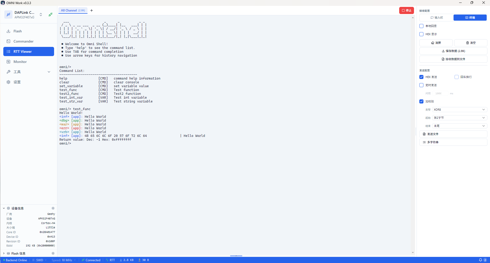
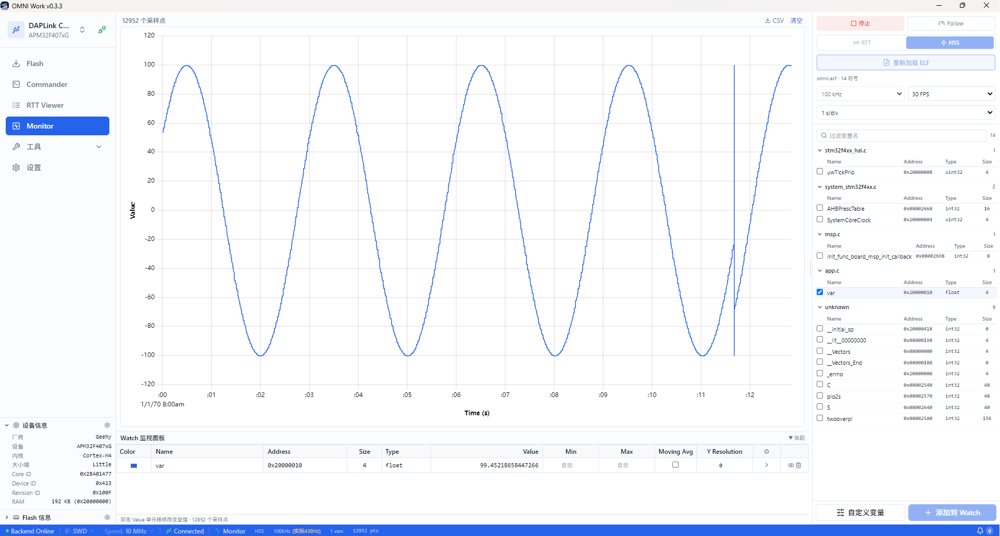
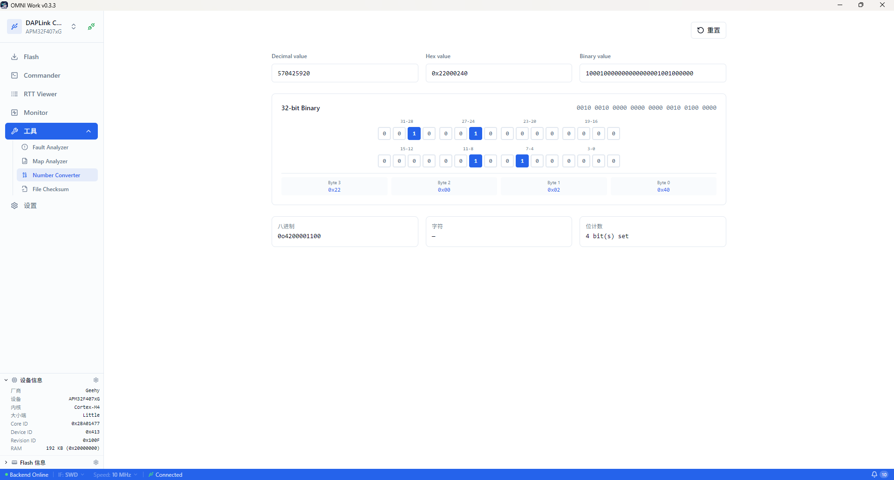

# OMNI Work

[](https://github.com/LuckkMaker/omni-work/releases/latest)
[](https://github.com/LuckkMaker/omni-work/blob/main/LICENSE)

OMNI Work 是一个嵌入式开发工具集，提供 Flash 烧录、Commander 交互式命令行、RTT Viewer 实时数据收发、Monitor 变量波形监控等核心调试功能，支持 DAPLink、JLink 等工具接入，适用于 STM32、GD32、APM32、NXP 等主流 Arm Cortex-M MCU 系列。


## 功能概览

| 模块 | 说明 |
|------|------|
| Flash 烧录工具 | 固件烧录、擦除（chip/sector）、校验、回读、Hex 查看器、Fill Memory、Compare |
| Commander 命令行 | 交互式 REPL，复用 pyOCD Commander，支持 `source` 命令配置源码路径 |
| RTT Viewer | SEGGER RTT 实时数据收发，多 tab 通道管理，文件发送/录制 |
| Monitor 变量监控 | DWARF 符号解析、SWD/RTT 传输、uPlot 波形图、触发、游标测量 |
| Tools 工具集 | Fault Analyzer、Map Analyzer、Number Converter、File Checksum |
| Settings | 终端主题、版本信息 |

## Flash 烧录工具

支持 bin/hex/elf 格式固件烧录，提供整片擦除与扇区擦除两种模式，烧录后可自动校验。Hex 查看器支持 1B/2B/4B 分组显示，配合 Fill Memory 与 Compare 功能完成数据级别的比对与填充操作。左侧设备面板实时显示探针连接状态与目标芯片信息，底部状态栏展示 SWD 接口、通信速率等连接参数。


## Commander 命令行

复用 pyOCD Commander 的交互式 REPL，支持 `reg`、`read32`/`write32`、`halt`/`continue`、`step`、`load`、`erase`、`disasm`、`where`、`symbol`、`elf`、`source` 等命令。`source` 命令参考 GDB 的 `directory`/`substitute-path` 设计，解决跨机器源码路径映射问题。右侧命令面板将 halt/step/reset 等常用命令归类为快捷按钮，并提供「调试」「断点调试」「解锁刷写」三套一键工作流，将多步命令链简化为单击操作。


## RTT Viewer

SEGGER RTT 实时数据收发，支持多 tab 通道管理、terminal/bar 两种输入模式、文件发送、录制到 `.dat` 文件。RTT 会话在应用顶层启用，切换页面不中断数据流。右侧配置面板提供 HEX 发送、定时发送、协议校验等选项，终端区域按日志级别（info/debug/warn/error）着色显示，底部状态栏实时展示数据速率与帧计数。



## Monitor 变量监控

通过 DWARF 符号解析自动从 ELF 文件提取变量地址，提供 SWD（HSS 非侵入模式）与 RTT（侵入高速模式）两种传输方式。波形图基于 uPlot 渲染，支持上升沿/下降沿/阈值触发、游标测量、CSV 导出。右侧变量树按源文件分组，勾选即可添加到监视列表；底部表格实时显示变量当前值、最值与移动均值。



## Tools 工具集

四个独立子工具：

- **Fault Analyzer** — Cortex-M 故障寄存器分析，解析 CFSR/HFSR/MMFSR/BFSR/UFSR 等寄存器，定位 fault 类型与原因
- **Map Analyzer** — ARM `.map` 链接器输出文件解析与可视化（基于 ECharts），分析 ROM/RAM/Stack 占用分布
- **Number Converter** — 十进制/十六进制/二进制互转，支持 32 位逐位点击编辑
- **File Checksum** — CRC32/MD5/SHA-1/SHA-256 校验和计算

Map Analyzer 顶部指标卡汇总 ROM/RAM 总量与 Code/RO Data/RW Data/ZI Data 分布，中部环形图展示 ROM 与 RAM 构成比例，底部柱状图按模块分类排列 Top 15 占用，帮助快速定位体积异常的代码段。


Number Converter 支持十进制、十六进制、二进制实时联动转换，32 位位网格可逐位点击翻转，并同步显示字节分解、八进制、ASCII 字符与置位计数。



## 环境要求

- **Node.js** 20+
- **Python** 3.11+（需包含 venv 模块）
- **DAPLink 仿真器**（CMSIS-DAP v1 或 v2）
- **目标 MCU 开发板**（建议 STM32 系列用于测试）
- Windows 10 或更高版本

## 快速开始

### 安装

```bash
# 安装前端依赖
npm install

# 创建 Python 虚拟环境并安装依赖
# Windows（使用系统 Python，非 TRAE 内置版本）
C:\Users\<用户名>\AppData\Local\Programs\Python\Python311\python.exe -m venv .venv
.venv\Scripts\pip.exe install -r python/requirements.txt
```

或使用 npm 脚本一键创建虚拟环境：

```bash
npm run python:install
```

### 运行

```bash
# 启动 Electron 开发模式（自动启动 Python 后端）
npm run dev
```

开发模式下 Python 后端使用固定端口 `8765`，Electron 通过 IPC 获取端口后前端自动连接。

### 单独运行 Python 后端（调试用）

```bash
# 使用 npm 脚本
npm run python:dev

# 或直接调用
.venv\Scripts\python.exe python/server.py --port 8765
```

### 类型检查

```bash
npm run typecheck
```

### 打包

```bash
# 一体化打包（构建前端 + PyInstaller 打包后端 + electron-builder 生成 NSIS 安装包）
npm run package

# 清理后重新打包
npm run package:clean
```

打包产物：`release/OMNI Work-0.3.3-x64-setup.exe`（NSIS 安装包）

## 支持的目标芯片

支持 70+ 款 Cortex-M MCU，包括 STM32、GD32、APM32、NXP 等主流系列。

## 文档

## 许可证

OMNI Work 采用 [MIT 许可证](LICENSE)，Copyright (c) 2026 LuckkMaker。

内置的 pyOCD 源码采用 [Apache 2.0 许可证](python/pyocd/LICENSE)，Copyright (c) 2006-2026 pyOCD Authors。

## 赞赏

如果这个工具对你有帮助，可以请作者喝杯咖啡。


