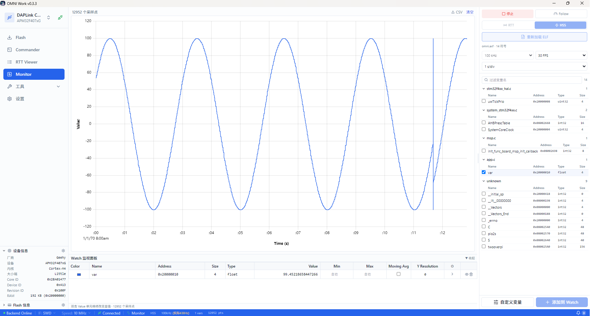

# Monitor

Monitor 页面提供变量实时监控与波形采样，对标 SEGGER J-Scope。

## 界面布局

中央波形图基于 uPlot 渲染，纵轴为变量值、横轴为时间，网格线辅助读数，顶部标注当前采样点数。右侧面板分为可视化控制区（暂停/开始、缩放范围、刷新频率、Y 轴、过滤设置）与变量树。变量树按源文件分组，勾选复选框即可将变量加入监视。底部 Watch 表格实时显示变量名称、颜色标识、地址、类型、当前值、最小/最大值、移动均值等列。

## 加载 ELF 文件

Monitor 通过 DWARF 调试信息自动从 ELF 文件提取变量地址。进入 Monitor 页面后，点击右侧变量树顶部的加载按钮选择 ELF 文件。加载成功后，变量树按源文件分组展示所有全局变量与静态变量。

仅支持包含 DWARF 调试信息的 ELF 文件（编译时需加 `-g` 选项）。 stripped 二进制文件无法解析变量地址。

## 选择变量

变量树按源文件分组（如 `main.c`、`system_stm32f4xx.c`、`app.c`），展开文件节点后勾选变量复选框，变量即加入波形图与底部 Watch 表格。每个变量自动分配一种颜色，波形图与表格中的颜色一致。

取消勾选则从波形图移除该变量曲线。

## SWD 模式（HSS）

SWD 模式使用 HSS（High-Speed Sampling）异步采样，通过 SWD 周期性读取内存，非侵入目标程序运行。适合长期监控、不希望影响目标时序的场景。

右侧可视化控制区设置采样频率（如 10 Hz、100 Hz、1 kHz）。实际采样率受 SWD 带宽限制，高频采样时实际速率可能低于标称值。

## RTT 模式

RTT 模式为侵入式高速采样，目标程序主动推送数据到 RTT 通道，适合高频采样场景。使用 RTT 模式需要在目标程序中集成数据推送代码，将待监控变量的值按约定格式写入 RTT 通道。

RTT 模式采样率远高于 SWD 模式，但会占用目标 CPU 时间与 RTT 带宽。

## 触发设置

触发功能在满足条件时自动暂停波形滚动，便于捕捉特定事件：

- **上升沿** — 变量值从低于阈值上升到高于阈值时触发
- **下降沿** — 变量值从高于阈值下降到低于阈值时触发
- **阈值** — 变量值跨越指定阈值时触发

在右侧触发设置区选择触发变量、触发类型与阈值。触发后波形冻结，可使用游标测量细节。

## 游标测量

在波形图上点击或拖拽可放置游标。游标之间的时间差与变量值差自动显示在游标标签中。多游标模式下可测量任意两点间的变化量。

## CSV 导出

点击波形图工具栏的导出按钮，将当前采样数据导出为 CSV 文件。每列为一个变量，每行为一个采样点，首行为变量名。CSV 可用 Excel、Python pandas 等工具二次分析。

> Monitor 采样与 Flash 操作互斥。执行 Flash 烧录或擦除时，Monitor 自动暂停采样；Flash 操作完成后自动恢复。
