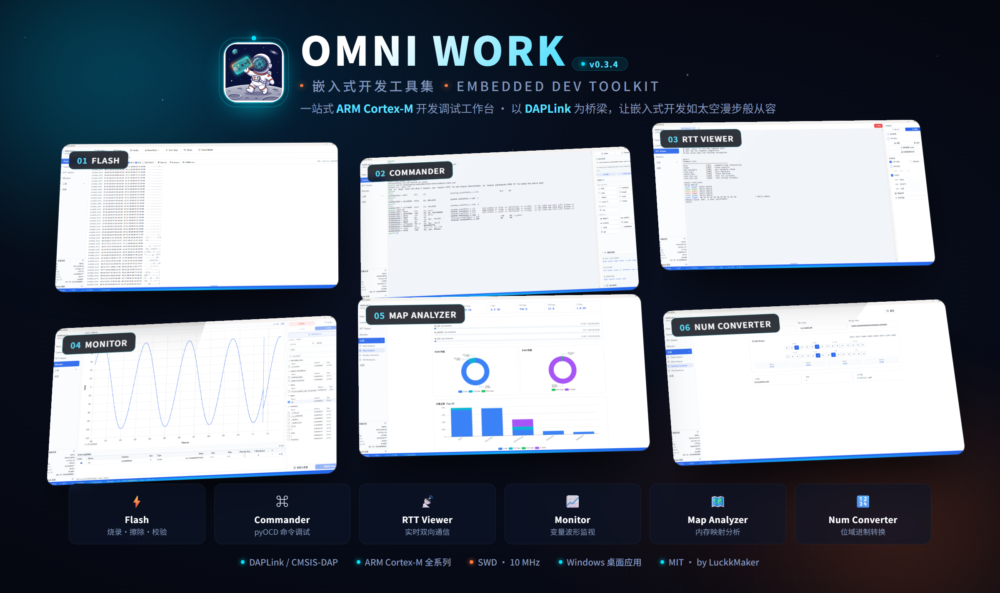
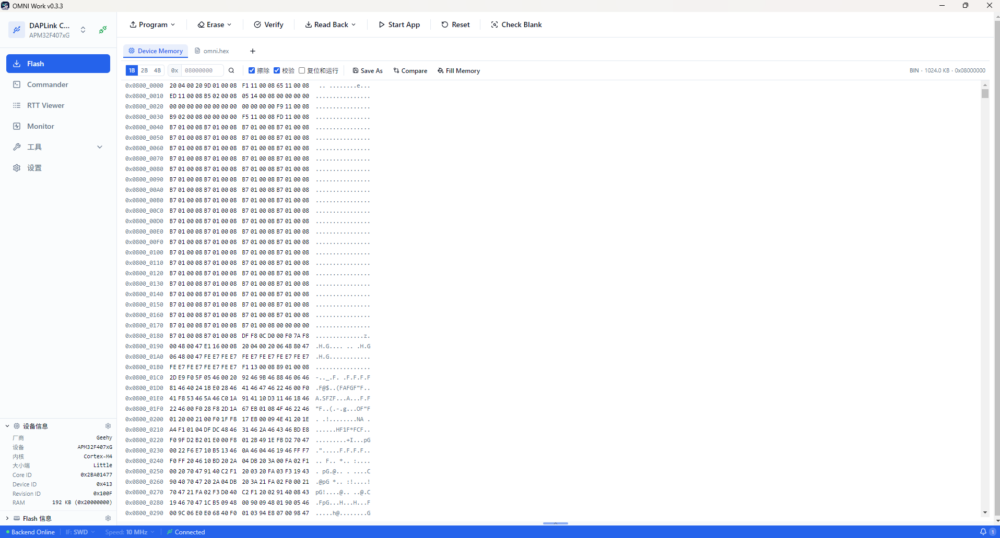
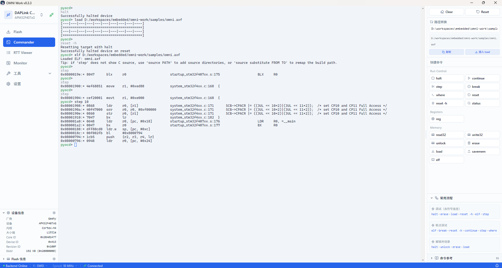
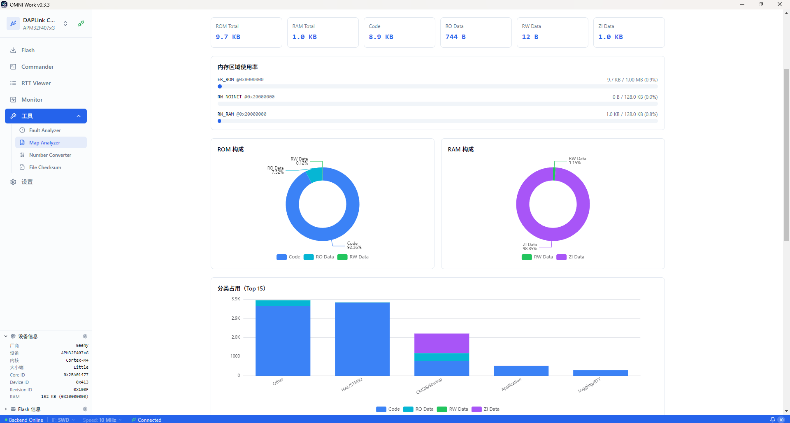

# OMNI Work

嵌入式开发工具集，提供类似 SEGGER J-Link 工具链的完整体验，以开源 pyOCD + DAPLink 硬件为基础，降低嵌入式开发者的工具成本。



## 项目简介

OMNI Work 是一个跨平台桌面应用，内置 Flash 烧录、交互式命令行、RTT 实时数据收发、变量波形监控等核心调试能力，对标 SEGGER J-Link 工具链。底层基于开源的 pyOCD，配合 DAPLink 等符合 CMSIS-DAP 标准的仿真器即可使用，无需购买 J-Link 硬件。

支持 70+ 款 Arm Cortex-M MCU，包括 STM32、GD32、APM32、NXP 等主流系列，通过 CMSIS Device Family Packs 可进一步扩展覆盖范围。

## 功能概览

| 模块 | 对标产品 | 说明 |
|------|----------|------|
| Flash 烧录工具 | J-Flash | 固件烧录、擦除（chip/sector）、校验、回读、Hex 查看器、Fill Memory、Compare |
| Commander 命令行 | J-Link Commander | 交互式 REPL，复用 pyOCD Commander，支持 `source` 命令配置源码路径 |
| RTT Viewer | J-Link RTT Viewer | SEGGER RTT 实时数据收发，多 tab 通道管理，文件发送/录制 |
| Monitor 变量监控 | J-Scope | DWARF 符号解析、SWD/RTT 传输、uPlot 波形图、触发、游标测量 |
| Tools 工具集 | — | Fault Analyzer、Map Analyzer、Number Converter、File Checksum |

### Flash 烧录工具



### Commander 命令行



### RTT Viewer


### Monitor 变量监控


### Map Analyzer



### Number Converter


## 文档导航

## 快速开始

```bash
# 安装前端依赖
npm install

# 创建 Python 虚拟环境并安装依赖
npm run python:install

# 启动开发模式
npm run dev
```

详细步骤见 [GitHub 仓库 README](https://github.com/LuckkMaker/omni-work#readme)。

## 许可证

MIT License，Copyright (c) 2026 LuckkMaker。
